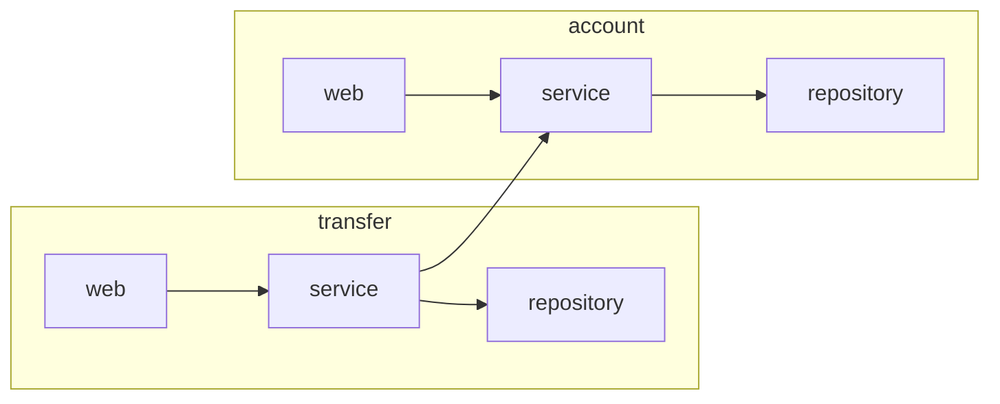
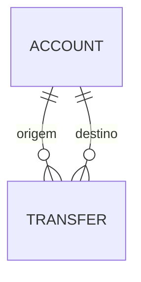

# Architecture Spine — Agentic Java Lab

## Design Paradigm

**Monólito modular, pacote por funcionalidade.** Um módulo Maven. Cada funcionalidade (`account`, `transfer`) é um pacote com sua própria organização interna, e as funcionalidades se falam só por serviços públicos.

- `web`: controllers e DTOs.
- `service`: regras de negócio e transações.
- `repository`: acesso a dados.
- `model`: entidades.

Essas quatro pastas são organização inicial. Não se cria camada ou classe sem necessidade.

## Invariants & Rules



### AD-1 — Monólito de um módulo, pacote por funcionalidade [ADOPTED]

- **Binds:** FR-13 a FR-17
- **Prevents:** pacotes por camada técnica global, módulos Maven extras e camadas ou classes criadas só por simetria.
- **Rule:** um módulo Maven. Pacotes `account` e `transfer`. Código, API e nomes de domínio em inglês. O ArchUnit protege só as fronteiras de AD-2, sem regras artificiais. Qualquer regra nova de arquitetura exige aprovação humana (NFR-3).

### AD-2 — `account` é o único dono do saldo [ADOPTED]

- **Binds:** FR-14, FR-15, FR-16
- **Prevents:** dois donos da mutação de saldo e acoplamento entre funcionalidades.
- **Rule:** só `account` altera saldo. `transfer` orquestra e usa apenas o serviço público de `account`, nunca seu `repository` nem seu `model`. `web` nunca acessa `repository`.

### AD-3 — Persistência e transações [ADOPTED]

- **Binds:** FR-13 a FR-17
- **Prevents:** esquema fora do Git e transferências parcialmente aplicadas.
- **Rule:** Spring Data JPA com PostgreSQL. O esquema muda só por migração Flyway. `@Transactional` no serviço. Uma Transferência é uma única transação atômica: débito, crédito e registro.

### AD-4 — Concorrência e saldo [ADOPTED]

- **Binds:** FR-16
- **Prevents:** saldo negativo sob operações concorrentes e deadlock entre transferências cruzadas.
- **Rule:** bloqueio pessimista (`SELECT … FOR UPDATE`) das duas contas **em ordem crescente de id**. O saldo é verificado depois do bloqueio. O banco impõe `CHECK (balance >= 0)`. Isolamento padrão do PostgreSQL.

### AD-5 — Representação monetária [ADOPTED]

- **Binds:** FR-13, FR-15, FR-16
- **Prevents:** arredondamento silencioso e formatos divergentes de valor.
- **Rule:** `BigDecimal` em Java e `NUMERIC(19,2)` no banco. Moeda BRL implícita, sem campo de moeda. Entrada com mais de 2 casas decimais é rejeitada, sem arredondar. No JSON, número decimal.

### AD-6 — IDs e status [ADOPTED]

- **Binds:** FR-13, FR-17
- **Prevents:** identificadores incompatíveis e estados especulativos.
- **Rule:** UUID v4 gerado pela aplicação, para conta e transferência. O status de Transferência tem um único valor, `COMPLETED`, guardado como texto. Um novo estado só entra por migração, com necessidade real e aprovação humana.

### AD-7 — Contrato HTTP [ADOPTED]

- **Binds:** FR-13 a FR-17
- **Prevents:** clientes e testes com expectativas divergentes.
- **Rule:**

| Operação | Sucesso |
| --- | --- |
| `POST /accounts` | 201 + `Location`, corpo `{id, balance}` |
| `GET /accounts/{id}` | 200, ou 404 se inexistente |
| `POST /transfers` | 201 + `Location`, corpo `{id, sourceAccountId, destinationAccountId, amount, status, createdAt}` |
| `GET /transfers/{id}` | 200, ou 404 se inexistente |

  Erros: **400** para entrada inválida (campo ausente, `amount <= 0`, `initialBalance < 0`). **422** para regra de negócio (conta inexistente, mesma conta, saldo insuficiente). Corpo no formato Problem Details (RFC 9457) com um código estável. Sem prefixo de versão e sem autenticação.

### AD-8 — Testes [ADOPTED]

- **Binds:** FR-4, FR-16
- **Prevents:** testes que passam num banco diferente do real e confusão entre régua e trabalho do agente.
- **Rule:** JUnit 5 com PostgreSQL real via Testcontainers, um contêiner compartilhado por execução. O principal são testes de HTTP contra o banco. Testes unitários só para lógica pura. Um teste de concorrência com várias threads. Sem H2. Os **testes de referência** ficam em um pacote separado (`reference`), incluindo o ArchUnit, e os testes escritos pelo agente ficam fora dele.

### AD-9 — CI mínimo [ADOPTED]

- **Binds:** FR-3, FR-4
- **Prevents:** verificações diferentes por agente.
- **Rule:** GitHub Actions em PR e em push na `main`. JDK 21, cache do Maven, `mvn verify` (compilação estrita, todos os testes e o ArchUnit). JaCoCo apenas informativo, sem limiar. O arquivo do workflow faz parte da baseline. Análise estática adiada até haver necessidade concreta.

### AD-10 — Marco de congelamento e baseline [ADOPTED]

- **Binds:** FR-1, FR-2, FR-5, FR-18
- **Prevents:** régua alterada sem registro e experimentos sem ponto de partida verificável.
- **Rule:** o marco é uma **tag Git anotada `freeze/exp-NN` na `main`**. A branch do experimento nasce dessa tag. `docs/lab/baseline.md` lista os artefatos congelados. Os testes de referência ficam identificáveis (AD-8). Uma alteração da baseline durante o experimento exige aprovação humana e é registrada como mudança ou desvio.

## Consistency Conventions

| Concern | Convention |
| --- | --- |
| Naming | Inglês no código e na API. Campos JSON em camelCase (`sourceAccountId`, `destinationAccountId`, `amount`, `balance`, `initialBalance`, `status`, `createdAt`). |
| Data & formats | Ids como UUID em texto. Datas em ISO-8601 UTC. Dinheiro conforme AD-5. Erros conforme AD-7. |
| State & cross-cutting | Saldo só muda conforme AD-2 e AD-4. Um único tratador global de erros (`@RestControllerAdvice`) em `common`, o único pacote transversal `[ASSUMPTION]`. Credenciais de desenvolvimento são descartáveis e locais, sem segredos reais no repositório (NFR-1) `[ASSUMPTION]`. |
| Change control | Mudar um `AD` exige aprovação humana e ADR quando apropriado (NFR-3). |

## Stack

| Name | Version |
| --- | --- |
| Java | 21 (LTS) |
| Spring Boot (Web, Data JPA, Validation) | estável compatível com Java 21, fixada na criação do projeto |
| Maven | fixada na criação do projeto |
| PostgreSQL | fixada na criação do projeto (imagem Docker com versão fixa) |
| Flyway | fixada na criação do projeto |
| JUnit 5, Testcontainers (PostgreSQL) | fixadas na criação do projeto |
| ArchUnit, JaCoCo | fixadas na criação do projeto |
| Docker e Docker Compose | conforme `docs/SETUP.md` |

## Structural Seed

```text
agentic-java-lab/
  pom.xml
  docker-compose.yml               # PostgreSQL para desenvolvimento local
  .github/workflows/ci.yml         # CI comum (baseline)
  docs/lab/baseline.md             # artefatos congelados
  src/main/java/<pacote-raiz>/     # pacote raiz definido na criação do projeto [ASSUMPTION]
    account/                       # web, service, repository, model
    transfer/                      # web, service, repository, model
    common/                        # só o tratamento de erros
  src/main/resources/db/migration/ # migrações Flyway
  src/test/java/<pacote-raiz>/reference/  # testes de referência e ArchUnit (baseline)
  src/test/java/<pacote-raiz>/            # testes escritos pelo agente
```



**Ambientes.** V1 sem ambiente implantado: desenvolvimento local (aplicação via Maven e PostgreSQL via Docker Compose) e CI no GitHub Actions. Sem cloud.

## Capability → Architecture Map

| Capability / Area | Lives in | Governed by |
| --- | --- | --- |
| Contas (FR-13, FR-14) | `account` | AD-1, AD-2, AD-3, AD-5, AD-6, AD-7 |
| Transferências (FR-15, FR-16, FR-17) | `transfer`, usando o serviço de `account` | AD-2, AD-3, AD-4, AD-5, AD-6, AD-7 |
| CI comum (FR-3, FR-4) | `.github/workflows/ci.yml` | AD-9 |
| Testes de referência (FR-4) | `src/test/.../reference` | AD-8, AD-10 |
| Congelamento e baseline (FR-1, FR-2, FR-5, FR-18) | tag `freeze/exp-NN` e `docs/lab/baseline.md` | AD-10 |

## Deferred

- **Versões exatas, pacote raiz e nome do artefato Maven:** na criação do projeto, pela story de infraestrutura.
- **ADRs em `docs/adr`:** a criar depois. Cada `AD` deste spine é candidato.
- **CODEOWNERS e job automático de guarda da baseline:** avaliar depois do primeiro experimento, se ele mostrar necessidade.
- **Análise estática:** quando houver necessidade concreta (por exemplo, com o Codex revisor). Até lá, o item correspondente da rubrica fica "quando existir".
- **Lista de códigos de erro estáveis:** definida nas primeiras stories de API, com os testes de referência.
- **Rubrica, diário e playbook (FR-6 a FR-12):** são artefatos documentais em `docs/lab`, sem arquitetura de software. A estrutura de `baseline.md` e de `docs/lab` fica para essas stories.
- **Fora da V1:** idempotência, estados assíncronos, eventos, resiliência distribuída, observabilidade, autenticação, versionamento de API, multimoeda e cloud.
- **Escopo de implementação da V1:** resolvido em 2026-09-21. Todos os FRs da API (FR-13 a FR-17) pertencem ao escopo funcional da V1, organizados no backlog em 3 a 5 stories; uma delas será a story medida, escolha em aberto.
